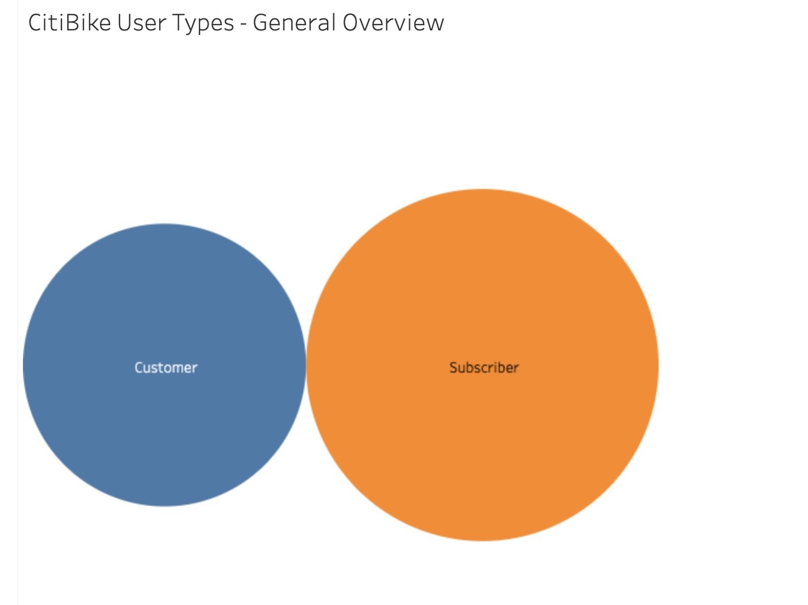

# Tableau-Challenge
 
 Congratulations on your new job! As the new lead analyst for the [New York Citi Bike](https://en.wikipedia.org/wiki/Citi_Bike) Program, you are now responsible for overseeing the largest bike sharing program in the United States. In your new role, you will be expected to generate regular reports for city officials looking to publicize and improve the city program.

 Since 2013, the Citi Bike Program has implemented a robust infrastructure for collecting data on the program's utilization. Through the team's efforts, each month bike data is collected, organized, and made public on the [Citi Bike Data](https://www.citibikenyc.com/system-data) webpage.

 However, while the data has been regularly updated, the team has yet to implement a dashboard or sophisticated reporting process. City officials have a number of questions on the program, so your first task on the job is to build a set of data reports to provide the answers.

## Submission 

The final submission includes:

* A link to your Tableau Public workbook that includes: 
  * 5 "Phenomenon" Visualizations 
  * 2 Dashboards
  * 1 City Official Map
  * 1 Story 
* A word document with my analysis on the phenomenons I uncovered from the data.

## CVS Manipulation

Two csvs were used from the [Citi Bike Data](https://www.citibikenyc.com/system-data) webpage, May 2020 and December 2020. The idea was to get a glimpse into the summer month opposed to the winter month. Joining the two csvs, I created two new columns for age and age range. This was possible because birth year data was provided. These columns were created because these characteristics are going to drive the entire analysis. 

## CitiBike Analysis

This project seeks to analyzes bike rentals by understanding the age range statistics of the data. The decision to look more deeply into the age of the users was in hopes to provide insights on who to target long term memberships to, understand the demographics of the frequent riders, and to better determine where bike start location should be whether it is summer or winter. 

The first graph, titled “User Types – General Overview”, provides a simple visualization to try and understand if there are more customers (short-term users) or more subscribers (long-term users). This graph will show that there are slightly more subscribers! However, lets dive deeper into this to try and learn ways to raise the subscriber numbers. 

The second graph, titled “User Types by Age Range – Summer/Winer Overview”, will help us to determine the demographics of these different users. From here, it is clear that subscribers have a higher count than customers. However, this graph describes the reason for low customer interaction. Within the winter month, bike rentals are way more likely to be rented from subscribers than customers. December, in general, already has a lower number of rides and the fact that few to no customers are renting makes the winter month a bad time for promoting subscriber memberships. My suggestion would be to target the 46-55 age range within the summer month of May, this is the highest peak of customer rides and these users could be more likely to purchase subscriber memberships. This abnormal spike in the graph can help CitiBike learn how they can target a demographic and make more money long term! 

The third graph, titled “Number of Rides by Age Range – General Overview”, is a bubble chart to understand what age range is doing the most bike renting. Again, this is a nice visualization to get a general grasp of rides per age group. As we could assume from the previous graph, the most prominent age group would be 26-35 followed closely by 46-55, showing a slight dip within the 36-45 age range. 

The fourth graph, titled “Number of Rides Compared to Avg Trip Duration by Age Range”, is a very extensive chart to determine how long a user will use a bike compared to how many times. For example, the age group 17-25 has a very low number of rides count yet that group is the second leading group for duration of ride. So, just because a certain age group has a low number of rides doesn’t necessarily mean they are using the bikes for less time, and vice versa. The highest age group with number of rides, determined in the last visualization at 26 – 35, has a lower average duration than most of the other ranges. This information can provide CitiBike with the knowledge to better plan their bike routes and pickup/dropoff locations. For example, the reason the age range 17-25 has short number of rides but longer duration times could be due to something like students renting the bikes, this could be further investigated and CitiBike can plan to put more/less locations in certain areas that are more accessible to students.  

The fifth graph, titled “Top 5 Start Locations by Age Range (Summer/Winter Overview)”, will drill further down to understanding the riders and their age groups. This graph provides insights on what age group is more likely to rent a bike from a certain area, whether it’s in summer or winter. Overall, Liberty Light Rail is the most frequent pick-up location. But to better understand the users, it’s easy to see that all of the age groups have their preferred pick-up location. Again, the group with the most rides is age group 26-25, and from here you can see that while they do use the Liberty Light Rail most, these users also frequent Newport Pkwy. This may be helpful to know, along with the other age group statistics, in determining where to put pick-up locations and when, summer or winter, to promote subscriber memberships at these same locations dependent on the age group. 

